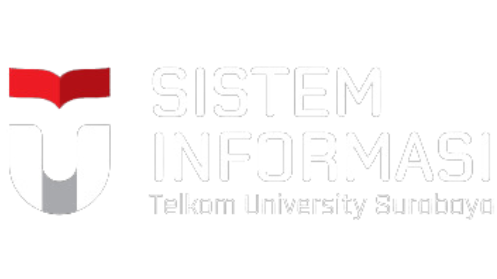
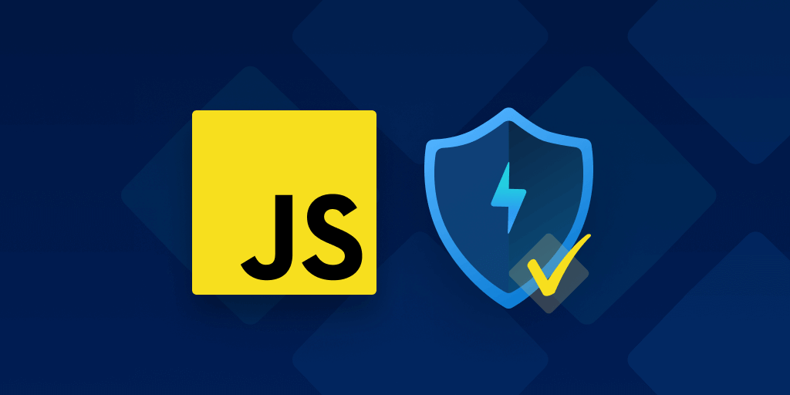
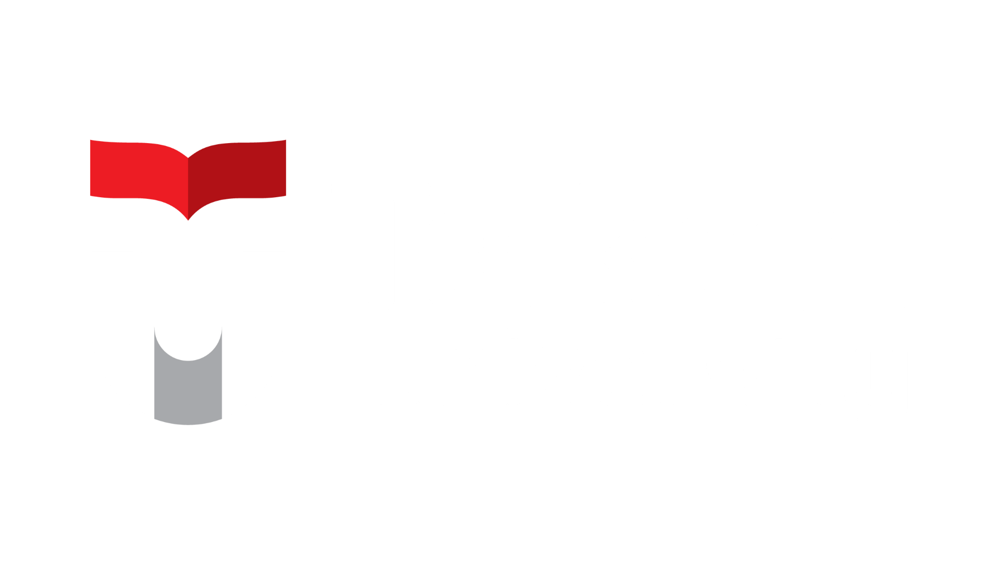
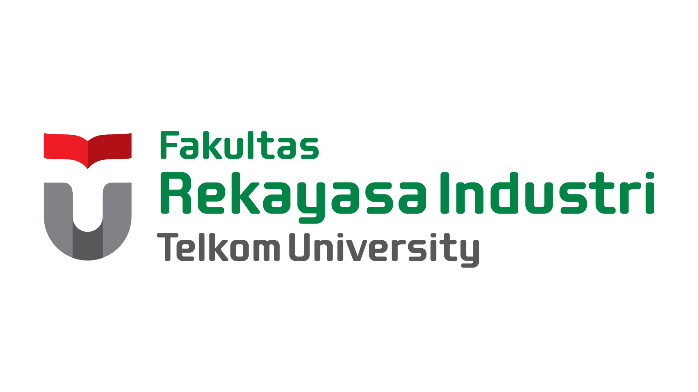

<!DOCTYPE html>
<html lang="en">
  <head>
    <meta charset="UTF-8" />
    <meta name="viewport" content="width=device-width, initial-scale=1.0" />
    <meta name="author" content="Yasmin Naila Ramadhanti">
    <meta name="description" content="tugas modul 4">
    <link rel="stylesheet" href="https://cdnjs.cloudflare.com/ajax/libs/font-awesome/6.6.0/css/all.min.css" integrity="sha512-Kc323vGBEqzTmouAECnVceyQqyqdsSiqLQISBL29aUW4U/M7pSPA/gEUZQqv1cwx4OnYxTxve5UMg5GT6L4JJg==" crossorigin="anonymous" referrerpolicy="no-referrer" />

    <title>Tugas Modul 4</title>
    <link rel="stylesheet" href="assets/style.css">
    

      
  </head>
  <body>
    <nav>
      

      

        &#9776;
      
      
      <ul>
        <li><a href="#">Tentang Kami</a>
            <ul class="dropdown">
                <li><a href="#">Informasi Umum</a></li>
                <li><a href="#">Organisasi</a></li>
                <li><a href="#">Penghargaan</a></li>
                <li><a href="#">Kerja Sama</a></li>
            </ul>
        </li>
        <li><a href="#">Akademik</a>
            <ul class="dropdown">
                <li><a href="#">Struktur kurikulum</a></li>
                <li><a href="#">Rencana Belajar</a></li>
                <li><a href="#">Beasiswa</a></li>
            </ul>
        </li>
        <li><a href="#">Kehidupan Kampus</a>
            <ul class="dropdown">
                <li><a href="#">Kehidupan di Surabaya</a></li>
                <li><a href="#">galeri Kegiatan</a></li>
                <li><a href="#">penelitian</a></li>
                <li><a href="#">Pengabdian masyarakat</a></li>
            </ul>
        </li>
        <li><a href="#">Dosen & Staf</a></li>
      </ul>
      <a href="#" class="button">Daftar Sekarang</a>
    </nav>
    <header>
        

            <h1>
                Pentingnya Integritas sebagai Fondasi Karakter Mahasiswa Sistem Informasi
            </h1>
            
2 JUN 2024 / ARTIKEL

        

    </header>
    
    
    

        <article>
            

                
            

            

                
Di era modern ini, kejujuran dan konsistensi dengan tindakan dan ucapan adalah sesuatu yang penting. Salah satu untuk mendapatkan sifat itu adalah dengan menerapkan prinsip integritas. 
                    Integritas adalah mutu, sifat, atau keadaan yang menunjukkan kesatuan yang utuh sehingga memiliki potensi dan kemampuan yang memancarkan kewibawaan atau kejujuran.
                     Jadi, semua perbuatan dan perkataan yang dilakukan seseorang akan mencerminkan integritas orang tersebut. Oleh karena itu, kita perlu memiliki sebuah prinsip integritas agar mendapat kepercayaan orang lain, membangun reputasi, dan juga membangun karakter positif. 
                     Integritas adalah prinsip yang perlu dimiliki oleh semua orang, bahkan mahasiswa.
                
  
                
Seperti yang disinggung oleh Rektor Telkom University, Prof. Dr. Adiwijaya pada EJLS bahwa seluruh mahasiswa perlu memiliki integritas. 
                    Terutama mahasiswa Telkom University. Meskipun Telkom University mempunyai banyak kampus yaitu Bandung, Jakarta dan Surabaya, tetapi semuanya harus memiliki integritas yang sama. 
                    Hal ini sangat penting karena integritas tidak hanya memengaruhi reputasi individu, tetapi juga berperan penting dalam kualitas pendidikan dan profiesionalisme di masa depan.
                     Mahasiswa bisa menerapkan integritas dengan mengerjakan tugas dengan orisinal dan jujur, sehingga kompentensi yang mereka dapatkan adalah hasil dari usaha dan kemampuan sendiri. Dalam rangka memperkuat prinsip ini, Program Studi Sistem Informasi mengadakan kuliah tamu yang membahas tentang pentingnya integritas.
                
  
                
Didalam kulliah tamu tersebut, dijelaskan bahwa integritas yang sangat penting ini dipengaruhi mempunyai 2 faktor. Faktor yang pertama adalah faktor internal. Faktor internal dalam integritas ini merupakan hal yang berasal dari dalam diri individu, misalnya nilai profesionalitas dan norma seseorang. 
                    Faktor internal ini menekankan pentingnya dedikasi terhadap etika. Faktor internal juga seringkali didorang oleh keyakinan agama dan prinsip moral yang kuat. Tetapi, integritas yang bergantung hanya pada faktor internal saja belum cukup. Selain faktor internal, terdapat juga faktor eksternal yang juga berperan penting dalam mendukung integritas suatu individu.
                
  
                
Faktor eksternal juga memiliki peran penting untuk mendukung integritas individu. Dalam perkuliahan, faktor eksternal bisa meliputi sistem pengawasan dan peraturan yang diterapkan baik untuk mahasiswa maupun dosen. Misalnya, pada Telkom University Surabaya yang dilengkapi dengan CCTV yang bisa membantu mendeteksi penyalahgunaan fasilitas kampus. 
                    Tanpa adanya hukuman atau sanksi, mahasiswa diharapkan untuk mengembangkan integritas yang kuat di dalam diri mereka sendiri.
                
  
                
Pada kuliah tamu, juga diberikan contoh nyata pentingnya faktor eksternal integritas. Contoh nyata tersebut terjadi di Univeristy Teknologi Mara, Malaysia. Di sana, pernah terjadi kejadian dosen menolak suap dari mahasiswa yang melanggar aturan. Mahasiswa ini diberi sanksi harus mengulang semester depan. Namun, mahasiswa ini malah ingin melakukan suap kepada dosen. 
                    Meskipun mahasiswa itu memiliki relasi dengan orang penting, dosen tersebut tetap berpegang teguh pada integritasnya karena adanya peraturan dan pengawasan yang ketat. Hal ini menunjukkan bahwa faktor internal seperti peraturan dan pengawasan bisa memperkuat integritas seseorang.
                
  
                

                    Seperti yang dibahas pada kuliah tamu oleh Ainatul Fathiyah Abdul Rahim, integritas adalah prinsip yang harus dimiliki oleh mahasiswa Sistem Infomrasi untuk memastikan kualiatas pendidikan dan profesionalisme yang tinggi. Webinar kuliah tamu internasional tersebut menekankan pentingnya integritas bagi mahasiswa dan bagaimana faktor internal dan  eksternal seperti peraturan bisa membantu membangun kepercayaan dan reputasi untuk masa depan.
                
 
                

                    Ternyata penting sekali ya, integritas untuk mahasiswa. Kalian juga bisa mendapatkan ilmu menarik lainnya dengan mengikuti instagram Prodi Sistem Informasi di sini. Selain itu, kalian juga bisa mengunjungi websitenya untuk mendapatkan informasi lengkapnya di sini.
                
 
                

                    <i style="font-size:24px" class="fa">&#xf012;</i> jumlah pengunjung : 801
                

            

            
            

                <h2>Tags</h2>
                

                    <a href="#"># Integritas</a>
                    <a href="#"># Kuliah Tamu</a>
                    <a href="#"># Mahasiswa Sistem Informasi</a>
                

            

            
            

                <a href="#" class="icon"><i class="fa-brands fa-facebook"></i></a>
                <a href="#" class="icon"><i class="fa-brands fa-x-twitter"></i></a>
                <a href="#" class="icon"><i class="fa-brands fa-linkedin"></i></a>
                <a href="#" class="icon"><i class="fa-brands fa-whatsapp"></i></a>
            
           
            

            

                <h2>Artikel Terkait</h2>
                

                    

                        
                        <h3>JavaScript, Keunggulan Bahasa Pemrograman Yang Masih Ramai Hingga Saat Ini</h3>
                        
September 27, 2024

                    

                    

                        
                        <h3>Explainable AI: Pengertian, Cara Kerja, Pentingnya, dan Penerapannya</h3>
                        
August 29, 2024

                    

                    

                        
                        <h3>Telkom University Surabaya Sukses Gelar East Java Student Leader Summit 2024</h3>
                        
May 21, 2024

                    

                

            

            
        </article>
    
    
      

        

            <h2>Cari Artikel</h2>
            <input type="text" placeholder="Search" />
        

        

            <h2>Kategori Artikel</h2>
            <ul>
                <li><a href="#">Artikel</a></li>
                <li><a href="#">Berita</a></li>
                <li><a href="#">kompentisi</a></li>
                <li><a href="#">penelitian</a></li>
                <li><a href="#">Pengabdian</a></li>
                <li><a href="#">pengumuman</a></li>
            </ul>
        

        

            <h2>Artikel terpopuler</h2>
            <ul>
                <li><a href="#">Informasi Semester Pendek 2023/2024-3</a></li>
                <li><a href="#">Rancangan UI/UX Aplikasi Smart IT MarineWise Ciptaan Mahasiswa Sistem Informasi ITTS Berhasil Meraih Juara 2 di UNS Tahun 2023</a></li>
                <li><a href="#">Dibuka Pelatihan dan Sertifikasi SAP 2024</a></li>
                <li><a href="#">Telkom University Surabaya Sukses Gelar East Java Student Leader Summit 2024</a></li>
                <li><a href="#">Gemerlap Dies Natalis ITTelkom Surabaya ke-5 : Technologia 2.0</a></li>
            </ul>
        

        

            <h2>Artikel terbaru</h2>
            <ul>
                <li><a href="#">JavaScript, Keunggulan Bahasa Pemrograman Yang Masih Ramai Hingga Saat Ini</a></li>
                <li><a href="#">Webinar : Mengungkap Modus Penipuan Digital (Cerita Korban Part 1)</a></li>
                <li><a href="#">Open Recruitment Asisten Laboratorium & Asisten Praktikum Prodi SI</a></li>
                <li><a href="#">Explainable AI: Pengertian, Cara Kerja, Pentingnya, dan Penerapannya</a></li>
                <li><a href="#">Pengabdian kepada Masyarakat: Pengembangan Aplikasi E-PSKS dan Integrasi dengan Server Kominfo</a></li>
            </ul>
        

        

            <h2>Tags</h2>
            <a href="#">2024</a>
            <a href="#">Beasiswa</a>
            <a href="#">Business</a>
            <a href="#">Canva</a>
            <a href="#">cumlaude</a>
            <a href="#">East Java Student Leader Summit</a>
            <a href="#">edugate</a>
            <a href="#">Founder</a>
            <a href="#">functional consultant</a>
            <a href="#">guest lecture</a>
            <a href="#">Inkubator Startup</a>
            <a href="#">Innovillage 2023</a>
            <a href="#">Integritas</a>
            <a href="#">ITTS</a>
            <a href="#">JavaScript</a>
            <a href="#">Jurnal</a>
            <a href="#">Kelebihan</a>
            <a href="#">Keunggulan</a>
            <a href="#">KOMUNIKASI</a>
            <a href="#">Kuliah Tamu</a>
            <a href="#">lowongan</a>
            <a href="#">mahasiswa</a>
            <a href="#">Mahasiswa Sistem Informasi</a>
            <a href="#">panelist</a>
            <a href="#">Penelitian</a>
            <a href="#">penghargaan</a>
            <a href="#">Pengmas</a>
            <a href="#">Pengusaha</a>
            <a href="#">prestasi</a>
            <a href="#">Prestasi Mahasiswa</a>
            <a href="#">Relawan</a>
            <a href="#">TIK</a>
            <a href="#">SAP</a>
            <a href="#">Sistem Informasi</a>
            <a href="#">SISTER</a>
            <a href="#">Startup Digital</a>
            <a href="#">Studi Banding</a>
            <a href="#">Surabaya</a>
            <a href="#">Telkom</a>
            <a href="#">Telkom University Surabaya</a>
            <a href="#">Text Mining</a>
            <a href="#">University</a>
            <a href="#">Webinar</a>
            <a href="#">White Swindler</a>
            <a href="#">wisuda</a>
        

      

    

  </body>

  <footer class="footer-container">
    

        <!-- Section 1: Logo dan Deskripsi -->
        

            
            
            
            
Program Studi Sistem Informasi sudah ada sejak berdirinya Universitas Telkom Surabaya, berdasarkan Keputusan Menteri Riset, Teknologi, dan Pendidikan Tinggi no. 733 / KPT / I / 2018.

             
            
<i class="fa-solid fa-location-dot"></i> Kampus Surabaya, Jl. Ketintang No. 156, Surabaya, Jawa Timur 60321

        

        <!-- Section 2: Tautan Bermanfaat -->
        

            <h4>Tautan Bermanfaat</h4>
            <ul>
                <li><a href="#">Telkom Indonesia</a></li>
                <li><a href="#">Yayasan Pendidikan Telkom</a></li>
                <li><a href="#">Universitas Telkom Surabaya</a></li>
                <li><a href="#">Fakultas Rekayasa Industri (FRI)</a></li>
                <li><a href="#">Website SMB</a></li>
            </ul>
        

        <!-- Section 3: Info Kontak -->
        

            <h4>Info Kontak</h4>
            
<i class="fa-solid fa-phone"></i> Telepon: +62 31 8280800

            
<i class="fa fa-envelope"></i> Email: is@ittelkom-sby.ac.id

        

        <!-- Section 4: Media Sosial -->
        

            <h4>Media Sosial</h4>
            

                <a href="#"><i class="fa-brands fa-instagram"></i></a>
                <a href="#"><i class="fa-brands fa-facebook"></i></a>
                <a href="#"><i class="fa fa-envelope"></i></a>
                <a href="#"><i class="fa-brands fa-youtube"></i></a>
            

        

    

    

    <!-- Copyright Section -->
    

        
&copy; 2024 Information Systems Telkom University Surabaya

    

</footer>

</html>
